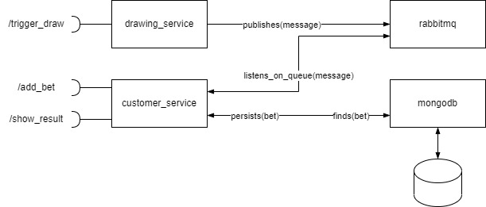

# lotto_soa

This congolmerate of services realizes a simple service oriented architecture of a lottery.
Three main actions are available for execution:
- `/add_bet` - a customer can register their own bet by supplying it to the endpoint
- `/trigger_draw` - a draw for the winning-numbers can be initiated 
- `/show_result` - the results expressed by an attribute `winning_class` shows for each bet their profit

To test out each deployment some example calls are provided and documented in the [_example_call_ directory](./example_calls/README.md).

### [Requirements/Tasks](https://moodle.thi.de/course/view.php?id=7642&section=1)

1. Two services with one having a persistence layer
    - [drawing_service](./drawing_service/)
    - [customer_service](./customer_service/)

    _customer_service_ is realized with a persistence layer in the form of [NoSQL MongoDB-Datenbank](https://www.mongodb.com/) with a corresponding [adapter](./customer_service/src/customer/application/db_client.py)

2. One of the service is realized with a hexagonal architecture
    - [drawing_service](./drawing_service/)

3. How to install the application in a VM
    - [How-to](#install-application-on-a-vm)

4. Dockerfiles and their execution strategy
    - [drawing_service](./drawing_service/README.md#docker)
    - [customer_service](./customer_service/README.md#docker)
    - docker commands for infrastructure components [see here](#docker-commands-for-infrastructure-services)
        - MongoDB
        - RabbitMQ

5. Docker Compose of entire application, execution strategy, NGNIX as load balancer
    - [Documentation of execution](./infrastructure/README.md)

6. Kubernetes Manifeste
    - [K8s](./k8s/README.md)

7. Automated Buildpipeline

    The build pipeline is realized with GitHub-Actions. The needed steps are described in the [github-workflows](./.github/workflows/). Their history of execution and builds can be seen [here](https://github.com/JoeG777/lotto_soa/actions).
    
    
8. Skizze der Service-Architektur
    **Architecture Overview**
    

    **Hexagonal Architecture of drawing_service**
    

---

# Information referenced by the above instructions

### Install application on a VM

1. Install _Python_
    Install _Python_ according to the [offical documentation](https://www.python.org/about/gettingstarted/) in version [_3.9_](https://www.python.org/downloads/release/python-390/)
2. Install _MongoDB_ according to the [official documentation](https://www.mongodb.com/docs/manual/installation/)
3. Install _RabbitMQ_ according to the [official documentation](https://www.rabbitmq.com/download.html)
4. Install the application - Move the source code or artifacts into the ROM of the VM by cloning the repository or moving them manuall
5. Setup the configuration for each of the sub-applications which in this project is done by passing or setting environment variables. Make sure the separate applications are reacheable by eachother for communication
    - [drawing_service](./drawing_service/README.md)
    - [customer_service](./customer_service/README.md)
6. Execute all the single parts in separate processes

### Docker commands for infrastructure services
- **MongoDB instance**
```
docker run -p 27017:27017 \
    --rm \
    --env-file ../.env \
    --name mongodb \
    --mount source=cnd_mongodb_data,target=/data/db \
    --network=lotto_local \
    mongo:6.0.3
```

- **RabbitMQ instance**
```
docker run -it \
    -p 5672:5672 \
    -p 15672:15672 \
    --rm \
    --mount source=cnd_rabbitmq_log,target=/var/log/rabbitmq/ \
    --mount source=cnd_rabbitmq_data,target=/var/lib/rabbitmq/ \
    --network=lotto_local \
    --name rabbitmq \
    rabbitmq:3.9-management
```
